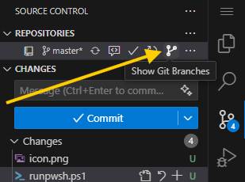
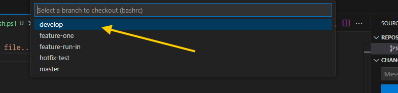
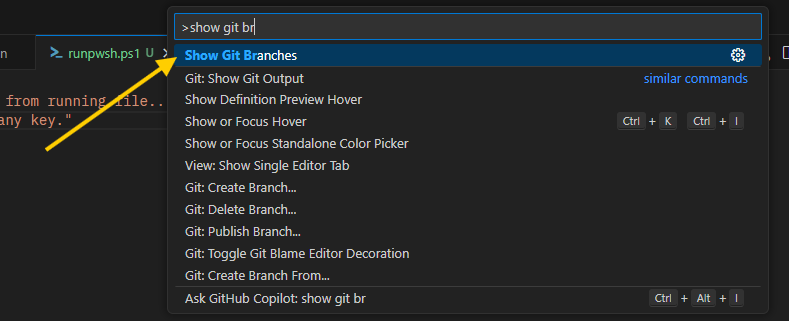

# Git Show Branches


A minimalist Visual Studio Code extension that displays only the branch names, keeping the interface simple and uncluttered. Easily view and switch Git branches directly from the Source Control view without extra details.

## Features

- Adds a custom button with a branch icon to the Source Control title bar for quick access to branch management.
- Lists all local and remote branches for each repository.
- Allows you to checkout branches with a single click.
- Integrated context menu and command palette support.
- Clean and intuitive UI, matching VS Code's native look.

## Usage

1. Open a folder containing a Git repository in VS Code.
2. Go to the Source Control view.
3. Click the branch icon button in the title bar to show all branches.

4. Select a branch to checkout directly from the list.

5. You can also run the command `Show Git Branches` from the command palette (Ctrl+Shift+P).


## Installation
You can install **Git Show Branches** directly from the [Visual Studio Code Marketplace](https://marketplace.visualstudio.com/items?itemName=SolorzanoJuanJose.git-show-branches):

1. Open VS Code.
2. Go to the Extensions view (`Ctrl+Shift+X`).
3. Search for `Git Show Branches`.
4. Click **Install**.

Alternatively, use the command line:

```sh
code --install-extension SolorzanoJuanJose.git-show-branches
```

## Commands

- `Show Git Branches`: Opens a list of all branches for the current repository and allows checkout.

## Contributing

Contributions are welcome! Please open issues or submit pull requests for improvements and bug fixes.

## License

This project is licensed under the MIT License.

---

**Author:** Solorzano-JuanJose
